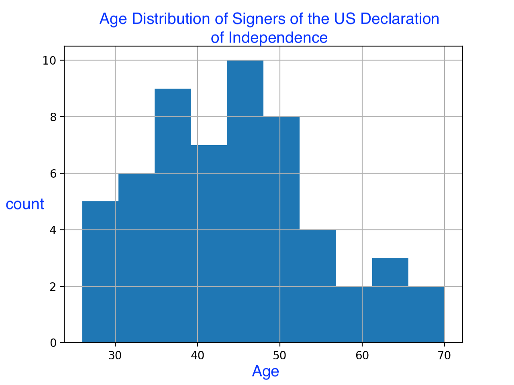

# foundingFathers

See `script.py` for the data analysis. Please feel free to use this in classrooms and to teach others about statistics or programming 🙂

Graphs are worth a bajillian words

Age Distribution of Signers of the US Declaration of Independence
| Minimum  | Q1 |  Q2 | Mean |  Q3 | Maximum |
|----------|----|-----|------|-----|---------|
|    26    |36.5|  44 | 44.27|  50 |    70   |

In conclusion, we see that most founding fathers were middle aged, with half 
being between 36 and 44 years of age. A quarter were 36 or younger, which is fairly young.
At least one founding father was 26 years old at signing, quite an 
accomplishment for that age. In the original data we see that James Monroe, the 5th
US president, was 18 at the age of signing, however, he himself did not sign it,
according to the data from the cited websited.

Actor James Wood brought up James Monroe when talking about how some people complain
about how the constitution was written by "a bunch of old white men". It seems his
statemenet is poorly structured because the declaration of independence and the
US constitution are two different things. On top of that the US constitution is
the sequel to its original incarnation, the Articles of Confederation. However,
there is a kernel of reason in James Woods broaching of the subject; the relative age
of the founding fathers is fairly young: 44 is younger than 60, and definitely younger than 
either Trump or Biden when either first became president in 2016 and 2020,
respectively.
